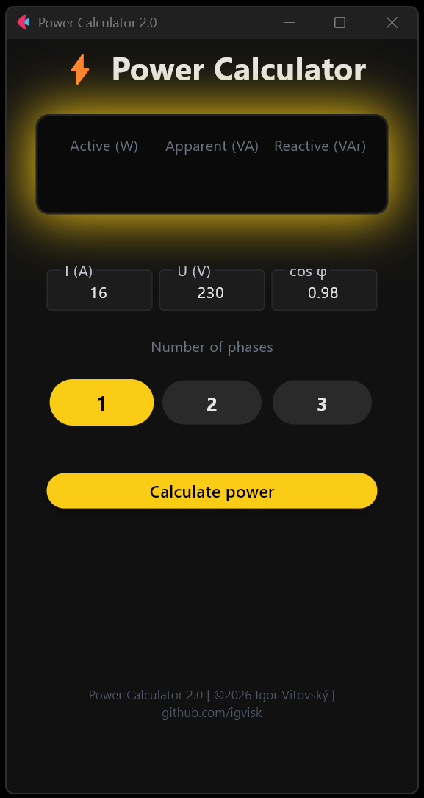

 
---

# ⚡ Power Calculator (Flet)

Modern electrical power calculator built with Python + Flet for fast and reliable calculations in single-phase and three-phase systems.

---

## 📸 Preview

---

## 🚀 Features
⚡ Active Power     (P)
⚡ Apparent Power   (S)
⚡ Reactive Power   (Q)

🔄 1-phase / 2-phase / 3-phase selection

    ✅ Automatic voltage validation
    ✅ Power factor validation
    🌙 Modern dark UI
    💻 Desktop build (Windows)
    📱 Android APK build support
    📐 Calculation Logic

    1-phase
    S = U × I
    P = S × cosφ
    Q = S × sinφ

    3-phase
    S = √3 × U × I
    P = S × cosφ
    Q = S × sinφ

Where:
    U = voltage (V)
    I = current (A)
    cosφ = power factor
    sinφ = √(1 - cos²φ)

🧠 Input Validation
Power factor range: 0.1 – 1
Voltage range depends on selected phase
Invalid values fallback to safe defaults
Voltage auto-adjusts when switching phase mode
Results rounded for clean display

---

## 🛠 Tech Stack
Python 3.13
Flet 0.80.5 (1.0b)
Flutter engine (via Flet build system)

▶️ Run Locally
Install dependencies:
pip install flet
Run the app:
python Power.py

Or using Flet CLI:
flet run Power.py

📦 Build
Windows
flet build windows

Android APK
flet build apk --module-name Power

---

## 📊 Default Parameters
    Parameter	        Default
    Current	            16 A
    Voltage (1-phase)	230 V
    Voltage (2,3-phase)	400 V
    Power Factor	    0.98

---

## 📁 Project Structure

    Power_Calculator/
    │
    ├── Power.py        # Main Flet UI application
    ├── logic.py        # Electrical calculation logic
    ├── images/
    │   └── Power_calc_flet.png
    ├── assets/
    │   └── icon.png
    ├── README.md
    └── LICENSE

---

## 📄 License

This project is licensed under the MIT License.

MIT License

Copyright (c) 2026 Igor Vitovský

Permission is hereby granted, free of charge, to any person obtaining a copy
of this software and associated documentation files (the "Software"), to deal
in the Software without restriction, including without limitation the rights
to use, copy, modify, merge, publish, distribute, sublicense, and/or sell
copies of the Software, and to permit persons to whom the Software is
furnished to do so, subject to the following conditions:

The above copyright notice and this permission notice shall be included in all
copies or substantial portions of the Software.

THE SOFTWARE IS PROVIDED "AS IS", WITHOUT WARRANTY OF ANY KIND, EXPRESS OR
IMPLIED, INCLUDING BUT NOT LIMITED TO THE WARRANTIES OF MERCHANTABILITY,
FITNESS FOR A PARTICULAR PURPOSE AND NONINFRINGEMENT. IN NO EVENT SHALL THE
AUTHORS OR COPYRIGHT HOLDERS BE LIABLE FOR ANY CLAIM, DAMAGES OR OTHER
LIABILITY, WHETHER IN AN ACTION OF CONTRACT, TORT OR OTHERWISE, ARISING FROM,
OUT OF OR IN CONNECTION WITH THE SOFTWARE OR THE USE OR OTHER DEALINGS IN THE
SOFTWARE.

---

## 👨‍💻 Author
    Igor Vitovský

    GitHub: https://github.com/igvisk